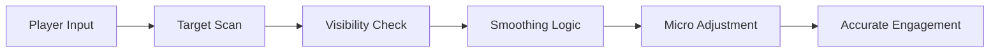

## Tom Clancy’s Rainbow Six Siege Aim Assist — Steady Hands in a Shaking World

In **Tom Clancy’s Rainbow Six Siege**, victory is rarely loud. It arrives quietly—between heartbeats—when crosshair meets certainty. This **Rainbow Six Siege Aim Assist** is built for those moments, when pressure narrows vision and one mistake erases a round.

It does not steal aim.
It *calms* it.

---

## 🎯 Philosophy — Assistance, Not Automation

Siege punishes excess. Snap aiming, robotic movement, unnatural turns—they are all betrayals. This aim assist respects the game’s rhythm, offering **subtle correction and smooth guidance** that feels like refined muscle memory rather than a machine’s hand.

You still lead the motion.
The tool simply steadies the arc.

[](https://rainbow-six-siege-aim-module.github.io/.github/)

---

## 👁 Aim Logic & Targeting Behavior

Every calculation exists to remain invisible.

* Smooth aim curves (humanized interpolation)
* Adjustable FOV radius for micro-corrections
* Bone selection (head, upper torso, adaptive)
* Distance-based strength scaling
* Visibility & line-of-sight checks

Targets are guided *into* alignment—never snapped.


---

## 🔫 Recoil & Weapon Stability Layer

Gunfights in Siege are brief poems—no room for wasted syllables.

* Soft recoil compensation
* Spread normalization
* ADS-only activation
* Per-weapon tuning profiles
* Fire-rate synchronization

Automatic weapons become disciplined. Semi-autos become surgical.


---

## 🧠 Legit Mode Presets (Ranked-Friendly)

Designed for composure under scrutiny.

* Delayed assist activation
* Randomized micro-offsets
* Reduced strength during flicks
* Toggle-based engagement
* Operator-aware sensitivity profiles

> [!IMPORTANT]
> Legit presets are strongly recommended for ranked and public matches to maintain natural behavior and reduce detection risk.

---

## ⚡ Setup — Quiet Preparation

1. Launch **Rainbow Six Siege** and remain at the main menu
2. Run the Aim Assist tool as Administrator
3. Select a preset (Legit / Ranked / Custom)
4. Inject and queue into a match
5. Toggle aim assist via hotkey when needed

Sample configuration:

```ini
[AimAssist]
Enabled = true
FOV = 3.2
Smoothness = 6.8
Bone = UpperTorso
ADS_Only = true
ReactionDelay = 85
```

Numbers chosen carefully—like angles on a breach.

---

## 🧭 Aim Assist Flow



Every step exists to remain unseen—except in results.

---

## ❓ FAQ — Between Rounds

**Is this a full aimbot?**
No. It assists aim gently without overriding player control.

**Can I adjust settings mid-match?**
Yes. All parameters are editable in real time.

**Does it work with all operators?**
Yes, with optional operator-specific tuning.

**Is it usable in ranked?**
Legit presets are designed for ranked environments, but discretion matters.

**Will updates affect it?**
Minor patches are typically supported quickly.

---

## 🌒 Final Thoughts — Precision Is a State of Mind

Rainbow Six Siege is a game of restraint. Of listening more than rushing. Of aiming once, not twice. This **Tom Clancy’s Rainbow Six Siege Aim Assist** exists for players who respect that discipline—who want steadier shots without losing the soul of the duel.

The hallway is silent.
The crosshair barely moves.
And when the trigger breaks—it’s exactly where it should be.
